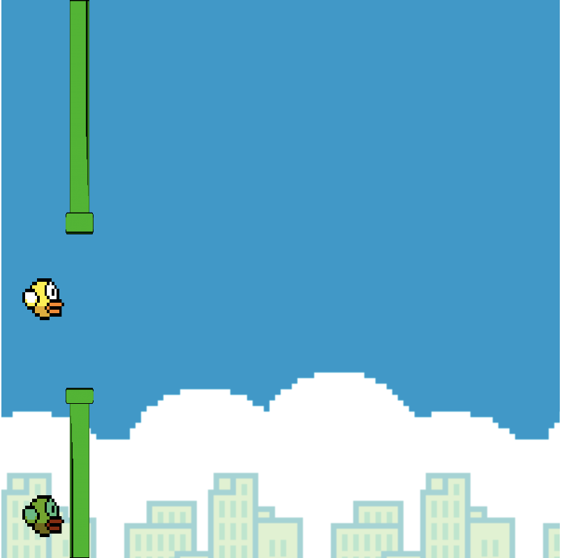

# flappyBirdMulti

CREATOR : BELVAL GIOVANNI

INTRODUCTION/

    this project is about to create the flappy bird game avalaible in 
    multiplayer.

    I'm using the p5.js framework in order to easyly draw the game board , and 
    socket.io in order to create a server that will proprely help to connect players 
    together in the same play.

SETUP/

    • install node using the nodeLink
    • create a node server that will render our <public> folder.
    • check the depedencies in packages.json and install them on your computer.
    • create a .env file at the same location that server.js and add variable :

        - WIDTH  (400 on my computer)
        - HEIGTH (400 ...)
        - W      (20  ...)
        - XSPEDD (2   ...)

        - PORT   (3000)
        - ADRESS (the adress you want to use | I use my wifi adress)
        - ORIGIN : http://{ADRESS}:{PORT}

    • start the server with <node server.js>

    
CODE EXPLANATION/

    sketch.js represents our players , and each layer has a bird.
    each time we draw a player one bird we send its coordinates to the server that will
    send it to player two so that he'll print player one's bird in his game board.

    the pipe only exists in the server and it is drawn in players's board at the same coordonates.

    each time we draw a pipe , we compute wether a bird touches the pipe or not.

HOW TO PLAY/

    • do the setup
    • go to <YOUR.IP.ADRESS:PORT>

TODO/

    • Better collide function
    • Count score
    • don't stop the game when one player hits the pipe but let the other player plays until he hits a pipe.
    • print scores

LINK/

    p5.js  : https://p5js.org
    NodeJs : https://nodejs.org/en/

